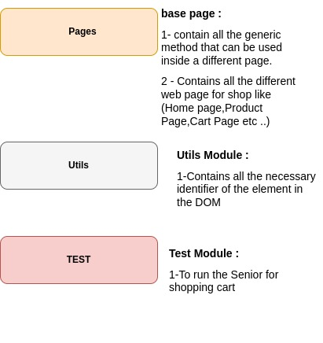

# Design Pattern Page Object Model with Python and selenium


Page-object-model (POM) is a design pattern that you can apply it to develop automation app.

1 - Each Page in the Web . We present it as a class on python .





#### If you want to run the test senario, you should type: 
```
python3 -m unittest 
```